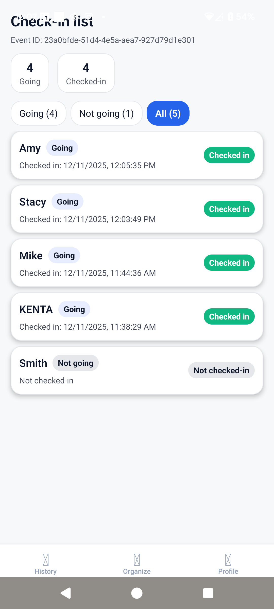
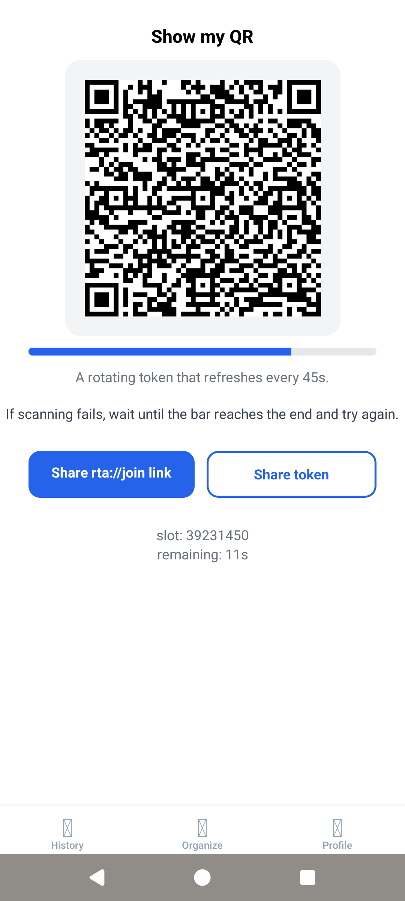
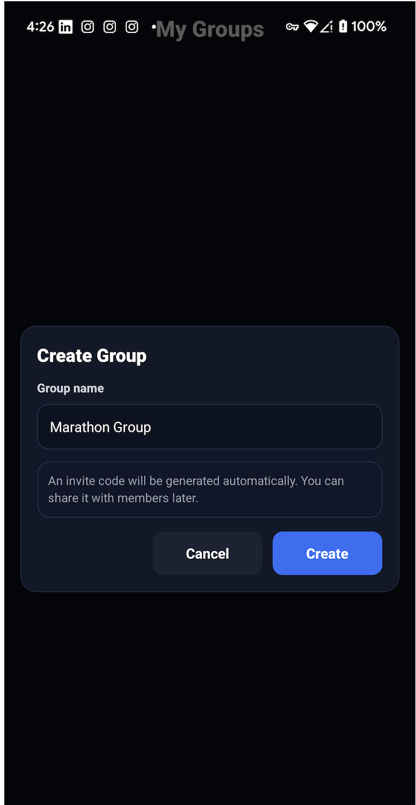

# GeoAttend — GPS + QR Attendance for Small Groups

GeoAttend is a lightweight attendance app for small teams and clubs. It combines **GPS geofencing + QR check-in** so organizers can record who actually showed up on-site—without using spreadsheets or heavy HR tools.

## 30-second overview

**GeoAttend records real, on-site attendance for small groups using GPS geofencing — with QR as a fallback when GPS is unreliable (e.g., indoors).**

- **Geofence gate:** check-in unlocks only inside the event radius + time window
- **QR fallback:** faster on-site flow + backup when GPS is inaccurate
- **Secure backend:** Supabase Auth + RLS to restrict data access by membership



✅ Available on Google Play (AU/NZ)

Download: https://play.google.com/store/apps/details?id=com.kenta0015.geoattendance.internal

Availability: Australia & New Zealand

Last updated: Dec 26, 2025

---

## Why this exists

Small teams and clubs often track attendance via paper lists, spreadsheets, or “react in the group chat.” It’s easy to start, but it breaks when you need:

- a reliable history of **who actually attended on-site**
- consistent check-in timing (late arrivals, partial attendance)
- something simpler than enterprise time-tracking systems

GeoAttend is built for **outdoor groups and recurring meetups** (running clubs, hobby groups, study meetups) where “good enough + trustworthy” matters.

---

## What you can verify quickly

If you’re reviewing this repo for a job application, here’s the fastest path to validate it:

- **End-to-end, location-verified check-in**: **GPS geofence gate (primary)** + **QR fallback** when GPS is unavailable/inaccurate, with attendance saved to Supabase

- **Organizer + attendee flows in one app** (easy to demo both sides without extra tooling)
- **Backend security model**: Supabase Auth + **Row Level Security (RLS)** for data access control

**Evidence & docs (start here):**

- **Google Play (AU/NZ)** build: https://play.google.com/store/apps/details?id=com.kenta0015.geoattendance.internal
- **Reliability validation (test plan + raw results):** `[docs/validation.md](docs/validation.md)`
- **Backend notes (schema + key RLS policies):** `[docs/backend.md](docs/backend.md)`
- Screenshots (quick UI context): `[screenshots/](screenshots/)`

**Reliability validation (controlled tests):**

- **25/25** successful proximity check-ins within **100m**
- **0/10** false unlocks at **300m+** (out-of-range attempts)

---

## Core flow (how it works)

1. Organizer creates an event with **location + radius**
2. Attendee opens the event (via invite link / in-app list)
3. Attendee taps **Check in** → the app verifies the attendee is **inside the geofence** (GPS = primary)
4. If GPS is unavailable/inaccurate, attendee uses **Scan QR** as a **fallback** check-in method
5. Organizer/attendee can view attendance history (stored in Supabase)

## Features

### Organizer

- Create events (date/time + geofence radius)
- - Optionally display a QR code for **fallback check-in** (when GPS is unavailable/inaccurate)
- View real-time check-in list + attendance history
- Optional invite links and simple participation/ranking views

### Attendee

- Join via invite link (recommended); use QR scan as a **fallback** when needed
- Check in only when **inside the event area**
- View personal attendance history

---

## Tech stack

**Mobile**

- React Native (Expo)
- Expo Router (navigation + deep linking)
- TypeScript
- Expo Location (GPS/geofence checks)
- Expo Camera / barcode scanning (QR)

**Backend**

- Supabase (PostgreSQL + Auth)
- Row Level Security (RLS)
- SQL functions/policies for safe access and check-in rules

**Tooling**

- Git/GitHub
- EAS Build + Google Play distribution
- Debugging via Expo DevTools + device logs

---

## Architecture (high level)

GeoAttend is a client–server app:

- Mobile client handles UI + GPS/QR logic
- Supabase stores persistent data and enforces access control via **Auth + RLS**

**Design highlights (what’s interesting)**

- QR is a fallback channel, secured with a rotating token (45s) + secret-based signing to reduce spoof/replay risk.
- Access boundaries are enforced with RLS around group/event membership (who can read/join/check in).
- Check-in integrity is protected by combining client-side geofence checks with server-side membership + time-window constraints.

**Key components**

- Auth: Supabase Auth
- Data: events, memberships, check-ins stored in Postgres tables
- Security: RLS policies restrict reads/writes by user + membership
- Check-in: client validates geofence; server stores check-in record

---

## Getting started (local)

### Prerequisites

- Node.js + npm (or yarn)
- Android device or emulator
- Supabase project (free tier works)
- Expo CLI (optional; `npx expo start` is enough)

### 1) Install

```bash
git clone https://github.com/kenta0015/geo-attend.git
cd geo-attend
npm install
# or
yarn install

```

### 2) Environment variables

Create a `.env` file:

```bash
EXPO_PUBLIC_SUPABASE_URL=your-supabase-url
EXPO_PUBLIC_SUPABASE_ANON=your-supabase-anon-key
EXPO_PUBLIC_ENABLE_DEV_SWITCH=true
EXPO_PUBLIC_QR_SECRET=your-secret-value
```

### 3) Supabase schema

You’ll need tables for:

- events
- event memberships
- attendance / check-in records
- (users handled by Supabase Auth)

This README does not include full SQL yet (portfolio-first repo).
If you want to reproduce the backend, inspect the Supabase queries in the codebase and create equivalent tables + RLS policies in your project.

### 4) Run

```bash
npx expo start
```

Then:

- press `a` for Android emulator, or
- scan the QR code using Expo Go on Android

---

## Demo (for reviewers)

Fastest way to evaluate GeoAttend:

- Use the **Google Play** link above (available in NZ and AU), or
- Run locally with your own Supabase project

Suggested demo path:

1. Sign up (Supabase Auth)
2. Create an event (organizer)
3. Show QR code
4. Join + check in (attendee) near the event location
5. Review check-in history

---

## Limitations / notes

- Built for **small outdoor groups / recurring meetups** (e.g., running clubs), where “simple + trustworthy” beats strict compliance tooling.
- **GPS accuracy depends on device + environment** (urban canyons, battery optimization), so the app uses **QR as a fallback** when GPS is unreliable.
- **Android-first validation** so far; iOS may behave differently due to location permission/OS constraints.
- The Supabase schema/RLS policies are tuned for this use case; reusing the backend for other products may require tightening/adjustments.

---

## Screenshots

## Screenshots

**Live check-in list (results view)**  


**Event dashboard & history**  


**Rotating QR (45s token refresh)**  


**GPS check-in confirmation**  


**Create group**  


---

## License / usage

**Portfolio / code review only — no license granted.**

You may view this repository for evaluation and learning purposes, but you may not reuse, redistribute, or create derivative works from the code without explicit permission.
