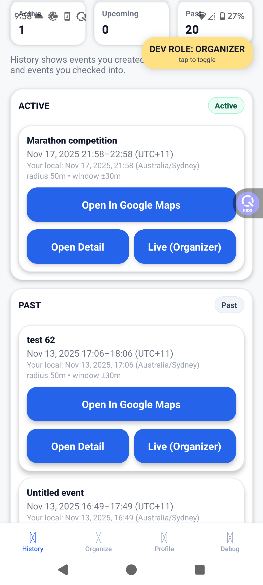
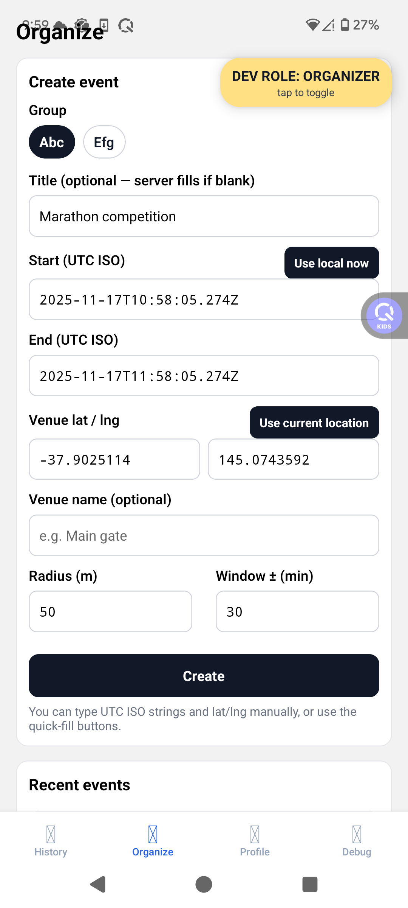
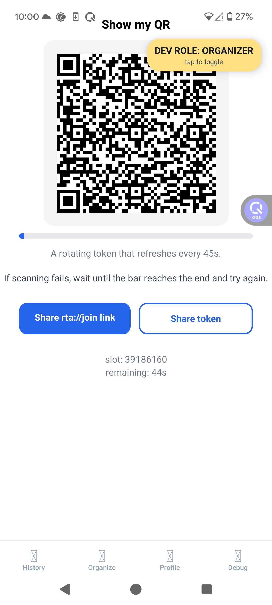
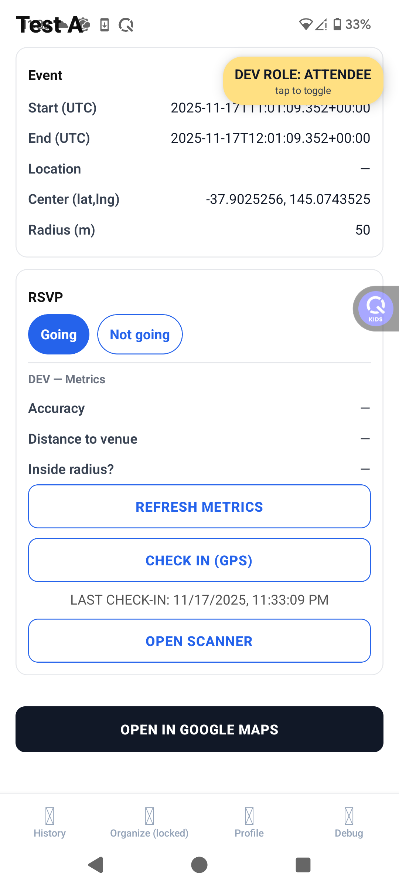
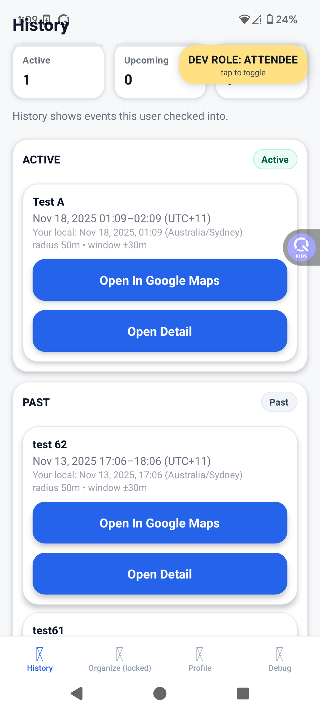

# GeoAttend

GeoAttend is a simple, location-aware attendance app for small teams and clubs, using QR codes and GPS to keep check-in history accurate.

---

## Overview

GeoAttend gives small teams and clubs a lightweight way to record **location-verified attendance**.

Instead of paper lists, messy spreadsheets, or “react in the group chat if you’re coming”, GeoAttend lets organizers create geofenced events and attendees check in with their phones. The app combines **QR codes + GPS** so check-ins are fast, but still tied to the actual event location and time.

This repository is primarily shared as a portfolio project and for code review in job applications.

---

## Problem

Small teams and clubs often track attendance with paper lists, shared spreadsheets, or casual “react in the group chat” methods. It’s quick to start, but it becomes messy when:

- You want to see **who actually showed up on site**, not just who said they would come.
- People arrive at slightly different times, and it’s hard to keep a reliable history.
- You don’t want to set up a heavy HR or enterprise time-tracking system just for a running group or small event.

As a result, organizers spend extra time cleaning up attendance records, and it’s hard to trust the data when planning future events or tracking participation.

---

## Solution

GeoAttend gives small teams and clubs a simple way to record **location-verified attendance**.

Organizers create a geofenced event, show a QR code at the meeting point, and attendees check in from their phones. The app combines **QR codes + GPS** so check-ins are fast, but still tied to the actual event location and time.

---

## Key Features

### For organizers

- Create events with date, time, and a geofenced location.
- Show a QR code on your phone so attendees can check in quickly.
- See who has checked in in real time, and review attendance history later.
- (Optional) Use invite links and simple ranking views to encourage participation.

### For attendees

- Join events via an invite link or by scanning a QR code.
- Check in from your phone — the app verifies that you’re inside the event area using GPS.
- View your own past attendance history.

### What makes it different

- Designed for **small, outdoor groups** like running clubs and meetups, not corporate HR.
- Uses **location-aware check-in** so attendance records show who actually came to the event location.
- Organizer and attendee flows live in the same app, making it easy to test and demo both sides.

---

## Use cases & current status

GeoAttend is built for small, recurring events where you want a simple but reliable record of who actually showed up.

Typical use cases include:

- Weekly running groups or outdoor training sessions
- Small club meetups (study groups, hobby clubs, language exchanges)
- Internal team events where you don’t need a full HR system but still want a clean attendance history

The app has been tested with simulated events and real GPS/geofence scenarios using Android devices, and is currently distributed via the **Google Play internal testing track** while preparing for use in live running group sessions.

---

## Tech stack

### Mobile app

- React Native with Expo
- Expo Router for navigation and deep linking
- TypeScript for type-safe components and data models
- Expo APIs for camera and barcode scanning (QR check-in)
- Expo Location and related services for GPS-based geofencing

### Backend

- Supabase (PostgreSQL + Supabase Auth)
- Row Level Security (RLS) to protect per-user and per-event data
- SQL functions and policies to enforce safe check-in logic

### Dev & tooling

- Git & GitHub for version control
- EAS / Google Play internal testing track for distributing test builds
- Basic logging and debugging using Expo DevTools and device logs

---

## Architecture overview

GeoAttend is a client–server app with most of the logic running on the mobile client and all persistent data stored in Supabase.

At a high level:

1. **Authentication**

   - Users sign in via Supabase Auth.
   - Each user can act as an organizer, attendee, or both, depending on how they use the app.

2. **Events & attendance data**

   - Events, memberships, and check-in records are stored in PostgreSQL tables managed by Supabase.
   - Row Level Security ensures users can only see and modify events and attendance data they are allowed to access.

3. **Check-in flow (QR + GPS)**

   - The organizer creates an event with a target location and radius (geofence).
   - On-site, the organizer shows a QR code that encodes event information.
   - The attendee scans the QR code, and the app:
     - Reads the event details,
     - Fetches the attendee’s current GPS position,
     - Verifies that the position is inside the event’s geofence,
     - Sends a check-in request to Supabase to store the attendance record.

4. **History & ranking**
   - Organizers can view attendance history by event.
   - Attendees can check their own past check-ins.
   - Simple ranking views can be built on top of the same attendance data (e.g., who joins the most sessions).

This setup keeps the backend relatively simple (Supabase handles auth and data), while the mobile app focuses on user experience, geolocation, and check-in logic.

---

## Getting started

This repository is mainly shared as a portfolio project.  
Most people will only need to read the code and this README, or use a test build that I provide in job applications.

If you want to run the app locally with your own backend, here is the rough setup:

### Prerequisites

- Node.js and npm (or yarn)
- Expo CLI (`npx expo start` is enough; global install is optional)
- An Android device or emulator
- A Supabase project (free tier is enough)

### 1. Clone and install

```bash
git clone https://github.com/your-username/geoattend.git
cd geoattend
npm install
or: yarn

```

### 2. Configure environment variables

Create a `.env` file (or use your preferred method for Expo env vars) and set:

    EXPO_PUBLIC_SUPABASE_URL=your-supabase-url
    EXPO_PUBLIC_SUPABASE_ANON=your-supabase-anon-key
    EXPO_PUBLIC_ENABLE_DEV_SWITCH=true
    EXPO_PUBLIC_QR_SECRET=some-secret-value

These keys are used for Supabase Auth / database access and for generating QR payloads.

---

### 3. Set up Supabase schema

You will need a Supabase project with tables for:

- Users (handled by Supabase Auth)
- Events
- Event memberships (who is invited / joined)
- Attendance / check-in records

The exact schema is not fully documented here yet; this project is primarily intended for code review and as a portfolio piece.
If you want to reproduce the full setup, you can inspect the queries in the codebase and create equivalent tables and Row Level Security policies in your own Supabase project.

---

### 4. Run the app

    npx expo start

Then:

- Press `a` to open on an Android emulator, or
- Scan the QR code in Expo Go on your Android device.

From there you can sign up, create test events, and try the check-in flow.

---

## Demo & testing

For most reviewers (e.g. hiring managers), the easiest way to experience GeoAttend is:

- Use the **Google Play internal testing build** link that I include in job applications, or
- Ask me for a test build and I can provide an APK or internal test invitation.

If you run the app locally with your own Supabase project, you can test both organizer and attendee flows using two accounts or two devices.

### Suggested demo flow

1. **Sign up and sign in**

   - Create a user account via the app (Supabase Auth).

2. **Create an event (organizer side)**

   - Create a new event with date, time, and location.
   - Set a geofence radius around the meeting point.
   - Open the “Show QR” screen for that event.

3. **Join and check in (attendee side)**

   - On another device (or another account), open the app.
   - Use the invite flow or the “Scan QR” option to join the event.
   - When you scan the organizer’s QR code near the event location, the app:
     - Reads the event details from the QR code,
     - Checks your current GPS location,
     - Confirms that you are inside the geofenced area,
     - Stores an attendance record in Supabase.

4. **Review history**
   - As an organizer, open the event’s attendance list or history view.
   - As an attendee, open your own history screen to see your past check-ins.

---

## Current status & limitations

- **Platform focus:**

  - Primarily tested on Android devices.
  - iOS support has not been the main focus yet, and behavior may differ, especially around location permissions.

- **Distribution:**

  - The app is currently distributed via the Google Play internal testing track.
  - It is not yet published as a public production app.

- **Location & geofencing:**

  - Check-ins rely on the device’s GPS accuracy and OS location settings.
  - In dense urban areas or with strict battery optimization, location updates may be slower or less accurate.
  - This app is designed for small events and running groups, not for strict legal time-and-attendance compliance.

- **Scale:**

  - The app is designed and tested for small teams and clubs, not for very large organizations or thousands of concurrent users.

- **Backend assumptions:**
  - The Supabase schema and RLS policies are tailored to this project and may need adjustment if reused in other contexts.

---

## Screenshots

_(To be added)_

Suggested set:

- Event list / dashboard
- Create event screen (with location & radius)
- Show QR (organizer)
- Scan QR & check-in confirmation (attendee)
- Attendance history

---

## License & usage

This project is shared mainly as a personal portfolio and learning resource.

You are welcome to:

- Browse the code and use it as a reference for learning, and
- Reuse small snippets or ideas in your own experiments.

If you plan to reuse major parts of this app in a commercial or production product,
please contact me first.

## Screenshots

**Organizer – event dashboard & history**



**Organizer – create geofenced event**



**Organizer – show rotating QR code for check-in**



**Attendee – event detail with GPS check-in**



**Attendee – personal attendance history**


