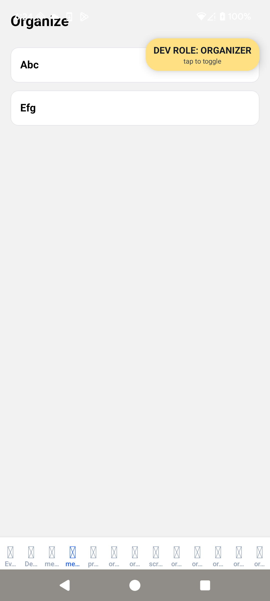

# 1.EXPO_PUBLIC_ENABLE_DEV_SWITCH は true で内部テスト中は OK。本番リリース前に false に戻すのを忘れないで。

# 2.インストール後のアプリの起動には monkey は使わない。起動は**am start -W**に統一　　ぐるぐるが発生する

### ADB launch & log (no monkey)

$adb = "$env:LOCALAPPDATA\Android\Sdk\platform-tools\adb.exe"
$serial = "192.168.1.208:34111"
$pkg = "com.kenta0015.geoattendance.internal"
$act = "$pkg/$pkg.MainActivity"
$out = ".\rta_after_launch.txt"

& "$adb" connect $serial | Out-Null
& "$adb" -s $serial shell am force-stop $pkg
& "$adb" -s $serial shell am start -W -n $act -a android.intent.action.MAIN -c android.intent.category.LAUNCHER
Start-Sleep -Seconds 45
& "$adb" -s $serial logcat -d -v time ReactNative:V ReactNativeJS:V Expo:V OkHttp:V AndroidRuntime:E ActivityManager:I WindowManager:W \*:S > $out
Get-Content $out -Tail 120

補足（運用ルール・超短）

pm clear は必要時のみ（初回 OTA 取得で待つ →“ぐるぐる”に見えるため）。

負荷試験やランダム操作以外で**monkey は使わない**。

再現テストは「手タップ」と同等の上記コマンドに固定。

# 3.WEB でアプリの開き方

### 1) Web 用に書き出し

npx expo export --platform web
cd C:\Users\User\Downloads\Real_time_attendance\rta-zero_restored
npx serve -s dist -l 5173

### 2) ローカルで配信（どれか入ってる方）

npx http-server dist -p 5173

### もしくは

npx serve dist -l 5173

# 4.USB の接続

端末で USB 接続後（USB debbugging ）

$pt = "C:\Users\User\AppData\Local\Android\Sdk\platform-tools"
$env:Path = "$pt;$env:Path"
adb version
adb devices

### そこから dec client で接続する場合

adb -d reverse --remove-all
adb -d reverse tcp:8081 tcp:8081

adb -d shell am force-stop com.kenta0015.geoattendance.internal
adb -d shell am start -W -n com.kenta0015.geoattendance.internal/.MainActivity
adb -d shell am start -W -a android.intent.action.VIEW -d "rta://expo-development-client/?url=http%3A%2F%2F127.0.0.1%3A8081"

# 5.Logcat

強化版 logcatA（最小セット：あなたの既定）
& "$adb" -s $serial logcat -c

# ← ここで 5 分ほど普通に操作（起動 → タブ遷移 →QR 画面 → 戻る 等）

& "$adb" -s $serial logcat -d -v time AndroidRuntime:E ReactNative:V ReactNativeJS:V \*:S `
| Tee-Object .\rta_crash_scan.txt

Select-String -Path .\rta_crash_scan.txt -Pattern 'FATAL EXCEPTION|AndroidRuntime|SoLoader|SIGSEGV|ANR' `
| Select-Object -First 50

強化版 logcatB（チェックイン周りを濃く）
& "$adb" -s $serial logcat -c

# ← 端末で「Check In」を 1 回タップ（10 秒以内）

Start-Sleep -Seconds 10
& "$adb" -s $serial logcat -d -v time ReactNativeJS:V ReactNative:V AndroidRuntime:E "\*:S" `
| Tee-Object .\rta_checkin_full.txt | Out-Null

Select-String -Path .\rta_checkin_full.txt -Pattern `  'qr_checkin_with_pin|Checked in|ARRIVED|TOKEN_INVALID|signature|expired|RAW_SCAN|token='`
| Select-Object -First 120

強化版 logcatC（events バッファも保存）
& "$adb" -s $serial logcat -c

# ← 端末で再現操作（〜10 秒）

Start-Sleep -Seconds 10
& "$adb" -s $serial logcat -d -v time AndroidRuntime:E ReactNative:V ReactNativeJS:V "\*:S" `
| Tee-Object .\rta_full.txt | Out-Null

& "$adb" -s $serial logcat -b events -d -v time "\*:S" `  | Select-String 'am_anr|am_crash|am_fully_drawn'`
| Tee-Object .\rta_events.txt | Out-Null

Select-String -Path .\rta_full.txt -Pattern 'FATAL EXCEPTION|AndroidRuntime|SoLoader|SIGSEGV|ANR|qr_checkin_with_pin|token=' `
| Select-Object -First 120

# 6.サインインの Deep Link

端末で rta://join を開く（Deep Link）
& "$adb" -d shell am start -a android.intent.action.VIEW -d "rta://join"

# devclient にアクセスできなかった件

何が原因だった？

ほぼ確実に（確信度 95%）

Metro に到達できていなかったのが本質。
具体的には

adb reverse が未設定／別端末に刺さっていた、

PowerShell で $adb が未定義のまま & $adb ... を打って失敗、

そのまま rta://... を開いても 端末 →PC の 8081 に橋が無くて JS バンドルが取れず、Unable to load script → 数秒後に黒画面、という流れ。
（途中で monkey を使うと別 Activity 経由になって状態がややこしくなるのも悪化要因。）

次回“確実に”つながる 2 ステップ

（PowerShell・USB 接続前提。コマンドはそのまま貼って OK）

1. Metro を起動して ADB 逆ポートを張る

# Metro（必要なら --port 変更可）

npx expo start --dev-client --clear

# ADB 実体と端末シリアルを確定

$adb = Join-Path $env:USERPROFILE 'AppData\Local\Android\Sdk\platform-tools\adb.exe'
if (!(Test-Path $adb)) { $adb = (& where.exe adb 2>$null | Select-Object -First 1) }
$serial = (& "$adb" devices | Select-String 'device$' | Select-Object -First 1).ToString().Split("`t")[0]

# 逆ポートをクリーン＆張り直し（Metro が 8081 ならそのまま）

& "$adb" -s $serial reverse --remove-all
& "$adb" -s $serial reverse tcp:8081 tcp:8081

# Metro 稼働確認（PC 側で OK が出れば良い）

Start-Process "http://localhost:8081/status"

2. Dev クライアントを前面 → ディープリンクで接続

# アプリ（Dev Client）を前面起動

& "$adb" -s $serial shell am start -W -n com.kenta0015.geoattendance.internal/.MainActivity

# 127.0.0.1 を使って Metro へ（※reverse 前提）

& "$adb" -s $serial shell am start -W -a android.intent.action.VIEW `
-d "rta://expo-development-client/?url=http%3A%2F%2F127.0.0.1%3A8081"

# ゴールまでの道順（ざっくり全体像）

1. プロファイル準備（internal / production）
2. 内部テスト用ビルドを作る＆配信
3. 内部テスターでチェック（短期で詰め切る）
4. 必要なら JS だけ EAS Update で即修正
5. ネイティブ変更は AAB 再ビルド → 内部テスト更新
6. OK なら **段階的公開**で本番へ（10%→25%→100%）
7. 監視＆必要ならロールバック/パッチ

---

# 具体手順

## 0. 事前セット（1 回だけ）

- `app.config.js` に **APP_ENV 切替**（internal/production）
- `eas.json` に **internal / production** プロファイル
- アプリ名/アイコン/アプリ ID を **internal と production で分ける**
  - 例：`com.kenta.geoattendance.internal` と `com.kenta.geoattendance`

## 1. 内部テストリリース（Internal track）

1. **バージョン更新**
   - `versionCode` を +1（Android）
   - `versionName` は `0.9.0-internal1` のように
2. **ビルド**
   - `eas build -p android --profile internal`
   - 署名 OK / ビルド完了まで待つ
3. **Play Console → 内部テスト → 新しいリリース**
   - 生成された **.aab** をアップ
   - リリース名：`0.9.0-internal1`
   - リリースノート（英語、短く）
4. **テスターを選択**（最低あなた＋ 1 人〜2 人）
   - オプトイン URL を共有
5. **公開（内部テストへ）**
   - 数分〜十数分で配信

## 2. チェックリスト（内部テストで見るもの）

- インストール〜初回起動が正常
- 権限：**正確な位置情報** / **カメラ** 許可と挙動
- `rta://join` でログイン導線に到達
- QR 打刻、位置打刻が通る（拒否時のエラー文言も確認）
- クラッシュ無し（Crashlytics などで確認）
- 英語 UI の崩れ無し / 時差・端末差（Pixel + Galaxy など）
- データ・セーフティ申告と挙動が矛盾していない

> バグが JS だけで直る → **EAS Update**（internal チャンネル）  
> ネイティブ/権限/Manifest 系 → **AAB を再ビルド**して内テスト更新（`versionCode`++）

## 3. クローズド or 段階的公開（本番前の安全弁）

- 内部で OK なら **直接本番**でも可。
- 不安があれば **クローズドテスト**（少人数）を 1 ラウンド。

## 4. 本番リリース（段階的公開を推奨）

1. **production ビルド作成**
   - `versionCode` を前より +1
   - `eas build -p android --profile production`
2. **Play Console → 本番 → 新しいリリース**
   - .aab アップ、リリース名：`1.0.0`
   - ノートに主要変更点
3. **段階的公開**
   - まず **10%** → 24–48 時間様子見 → 25% → 100%
   - クラッシュ/レビュー/権限拒否率を監視

## 5. 監視と即応

- 監視：**クラッシュ率 / ANR / 権限拒否 / 位置許可の精度**
- JS だけの軽微修正：**EAS Update**（production チャンネル）
- ネイティブ修正：**新 AAB** を **同じ段階的公開**で上書き
- 重大障害なら：**段階率を止める or 前バージョンへロールバック**

---

# 付録：現実的な時間配分（目安）

- 内部テスト初回ビルド〜配信：30–60 分
- 内部検証：半日〜1 日
- 追加修正（1–2 回）：数時間
- 本番の段階的公開：1–3 日（10%→25%→100%）

---

# 内部テストのロードマップ

1.インストール〜初回起動が正常 →OK

2.権限：正確な位置情報 / カメラ 許可と挙動 →OK

3.rta://join でログイン導線に到達 →OK

4.QR 打刻、位置打刻が通る（拒否時のエラー文言も確認）→ 未

5.クラッシュ無し（Crashlytics などで確認）→ おそらく未

6.英語 UI の崩れ無し / 時差・端末差（Pixel + Galaxy など） 英語 ui の崩れは ok・時差・端末差はおそらく未 7.自分の所属/organize しているグループを表す下に表示されるタブが隠れてしまっている（画像により me...にあるのは確認済み）
　

8.データ・セーフティ申告と挙動が矛盾していない　 → 未

9.

バグが JS だけで直る → EAS Update（internal チャンネル）
ネイティブ/権限/Manifest 系 → AAB を再ビルドして内テスト更新（versionCode++）
